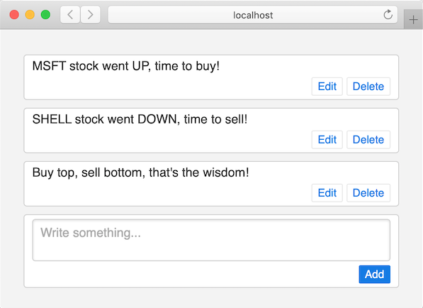

Nim Web Framework

Simple and clean code, fluid interactive UI, plain Nim C-runtime no need to compile to JS.

Checkout [Twitter in 60 lines of Nim](mono/examples/twitter.nim) and [7min Video](https://www.youtube.com/watch?v=7Owct-njg0s)



Run it

```
nimble install https://github.com/al6x/nim?subdir=mono
nim r --experimental:overloadable_enums --threads:off twitter.nim
```

Or start with the [Hello Example](mono/examples/hello.nim), the form and greeting message will be updated dynamically:

```Nim
import base, mono/[core, http]

type Hello = ref object of Component
  name: string

proc render(self: Hello): El =
  el"":
    el("input", it.bind_to(self.name))
    if not self.name.is_empty:
      el("span", (text: "Hello " & self.name))

run_http_server(() => Hello())
```

Mono allows to structure UI code as atomic and reusable components. To see the difference, compare [Twitter](mono/examples/twitter.nim) and version of [Twitter with Components](mono/examples/twitter_comp.nim). It has slightly more lines of code, but it pays for larger app.

# Install

`nimble install https://github.com/al6x/nim?subdir=mono`

Then run [Hello Example](mono/examples/hello.nim) and start experimenting.

Use `import base/log; log_emitters.len = 0` to silence the default console logger.

# Features

- Reactive, like Svelte or React.
- Stateful Components and bidirectional data binding.
- Fast initial page load and SEO friendly.
- Works on Nim Server, or Compile to JS in Browser.
- Support for Browser Title, Location, Favicon, Back/Forward Buttons.

# Component Templates

- Clean UI with Components similar to Svelte or JSX.
- Components are interactive atomic blocks.
- Stateless Functional and Stateful Object Components.
- Template is plain Nim code.
- Slots, block passed as additional `content: seq[El]` argument.
- Also, custom slots could be used in block scope, like `layout.left/right`.
- Tag shortcut helps keep code small.
- No wait for Nim compilation, plays well with Tailwind, autocomplete etc.
- Context with `threadvar`.

# Development and contributing

Checkout the repo, then run

- `nim r --experimental:overloadable_enums --threads:off mono/test.nim test` for tests.
- `nim r --experimental:overloadable_enums --threads:off mono/examples/twitter.nim` for example.

The whole library is just one function

```Nim
let out: seq[OutEvent] = session.process(events: seq[InEvent])
```

Checkout [core](mono/core) and tests to see how it works.

Other packages are adapters to connect that function to different environments like Browser or Server.
And provide transport for messages, like HTTP. You could replace it with your own adapter and transport,
like WebSocket.

I use a simple HTTP server and not WebSocket, because I want to avoid dependencies and
keep the code size small, to have fast Nim compilation. You can change that and rewrite server to use WebSocket.

# Todo

- Maybe use buit_el
- Flash doesn't work on todo and hello and twitter properly
- Browser Adapter with multiple widgets in the page and interactive charts.
- Better Async/Actor/Networking code.
- Slots for templates

# Ideas

- Integration with WebComponent, Svelte, React, UI Kits.
- Integration with LiveView, RoR, Laravel solutions for Desktop, IoS, Android.

# License

MIT
