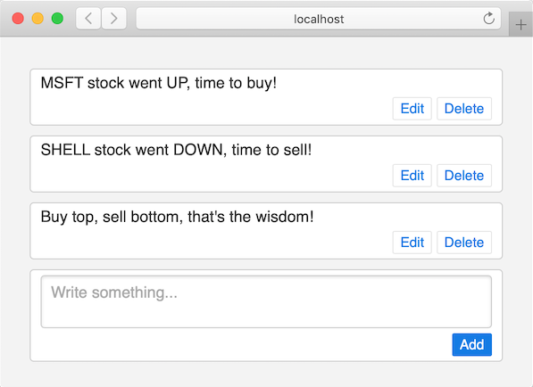

Nim Web Framework

Simple and clean code, fluid interactive UI, plain Nim C-runtime no need to compile to JS.

Checkout [Twitter in 60 lines of Nim](mono/examples/twitter.nim) and [7min Video](https://www.youtube.com/watch?v=7Owct-njg0s)



Run it

```
nimble install https://github.com/al6x/nim?subdir=mono
nim r --experimental:overloadable_enums --threads:off twitter.nim
```

Or start with the [Hello Example](mono/examples/hello.nim), the form and greeting message will be updated dynamically:

```Nim
import base, mono/[core, http]

type Hello = ref object of Component
  name: string

proc render(self: Hello): El =
  el"":
    el("input", it.bind_to(self.name))
    if not self.name.is_empty:
      el("span", (text: "Hello " & self.name))

run_http_server(() => Hello())
```

Mono allows to structure UI code as atomic and reusable components. To see the difference, compare [Twitter](mono/examples/twitter.nim) and version of [Twitter with Components](mono/examples/twitter_comp.nim). It has slightly more lines of code, but it pays for larger app.

# Install

`nimble install https://github.com/al6x/nim?subdir=mono`

Then run [Hello Example](mono/examples/hello.nim) and start experimenting.

Use `import base/log; log_emitters.len = 0` to silence the default console logger.

# Features

- Reactive, like Svelte or React.
- Stateful Components and bidirectional data binding.
- Fast initial page load and SEO friendly.
- Works on Nim Server, or (in next version) Compile to JS in Browser.
- Support for Browser Title, Location, Favicon, Back/Forward Buttons.

# Development and contributing

[How it Works](docs/how_it_works.md)

Checkout the repo, then run

- `nim r --experimental:overloadable_enums --threads:off mono/test.nim test` for tests.
- `nim r --experimental:overloadable_enums --threads:off mono/examples/twitter.nim` for example.

Transport Layer is replaceable, currently simple HTTP server used. It could be changed to different protocols, like WebSockets, with specific auth, load balancing and session management etc.

I use simple HTTP server and not WebSocket, because I want to avoid dependencies and keep the code size small, to have fast Nim compilation.

# License

MIT
