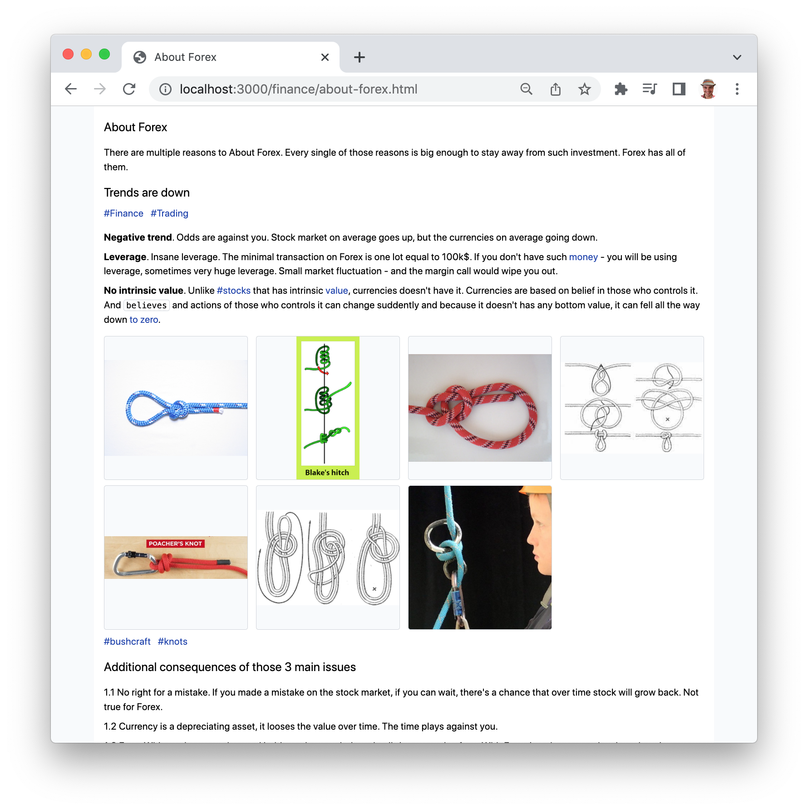
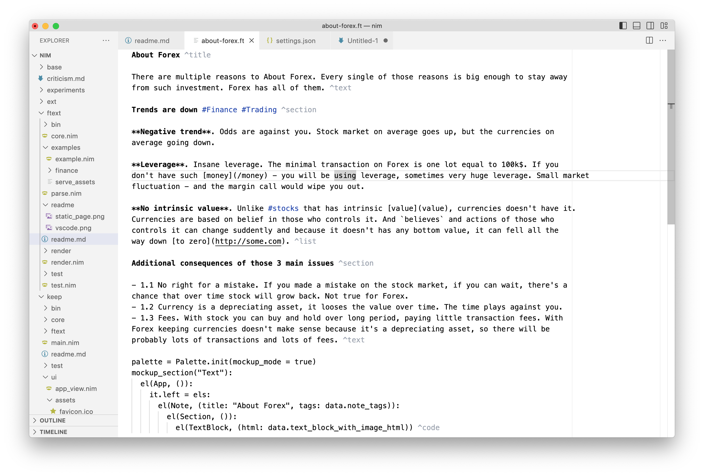

Formal Text, Text as Data

Markdown specify How it Looks, FormalText specify What it Means.

The Formal Text document is a sequence of blocks, blocks could be of different types, text,
list, table, images, charts etc.

I'm using it for Notebook App, but it also could be used separately.

# Todo

- Hash of doc should also include hash of its assets

# Features

Invisible, it try to look like normal text as much as possible.

Extensible, blocks, embeds, assets, define your own.

Validates the correctness of the data, tags, links, asset paths are validated.

Default blocks - text, image, images, code, data

Searchable, each block exposes its content as text, tags which is then used to search.

Collections of blocks, while blocks belongs to document, it's possible to query docs separately
and assemble virtual docs of blocks of various sources.

Could be used as a standalone document, or as document in notebook app, wich spaces, docs, full text search,
etc.

# Example

Example of FormalText

```
About Forex ^title

There are multiple reasons to About Forex. Every single of those reasons is big enough to stay away
from such investment. Forex has all of them. ^text

Trends are down #Finance #Trading ^section

**No intrinsic value**. Unlike #stocks that has it can fell all the
way down [to zero](http://some.com). ^text

knots #bushcraft #knots ^images
```

Note the last line with `knots` the images from the `knots` folder will be displayed as a gallery.

Rendering Formal Text:

```
nimble install https://github.com/al6x/nim?subdir=releases/ftext@#releases

nim r ftext/examples/example.nim

# To serve images properly the static server needed
# npm install -g node-static
ftext/examples/bin/serve_assets

open http://localhost:3000/finance/about-forex.html
```

And you should see this page



# VSCode integration



Install 'Highlight' by 'Fabio Spampinato' extension, and then add following to VSCode `settings.json`

```JSON
  "highlight.regexes": {
    // tags
    "(#[a-zA-Zа-яА-Я]+[a-zA-Zа-яА-Я0-9]*)": {
      "filterFileRegex": ".*.ft$",
      "decorations": [
        { "color": "rgb(30, 64, 175)", "fontWeight": "normal" } // "textDecoration": "underline"
      ]
    },

    // title and section
    "([^\n]+?)(\\s*\\^title|\\s*\\^section)(\\s*\n|\\Z)": {
      "filterFileRegex": ".*.ft$",
      "decorations": [
        { "fontWeight": "bold" } // "textDecoration": "underline"
      ]
    },
    // Command
    "(\\s*)(\\^[a-z0-9]+\\s*)(\n|\\Z)": {
      "filterFileRegex": ".*.ft$",
      "decorations": [
        { "color": "#9CA3AF" }, { "color": "#9CA3AF" }
      ]
    },
    // Bold
    "(\\*\\*[a-zA-Z0-9\\s]+\\*\\*)": {
      "filterFileRegex": ".*.ft$",
      "decorations": [
        { "fontWeight": "bold" }
      ]
    }
  }
```